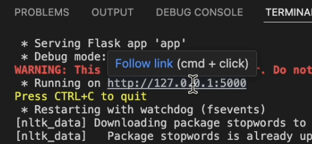

# SMS Spam Detection 

__SMS Spam Detection__ is a supervised machine learning project that uses natural language processing (NLP) techniques to classify SMS messages as either "Spam" or "Not Spam." This project leverages the popular [SMSSpamCollection dataset](https://archive.ics.uci.edu/ml/datasets/SMS+Spam+Collection) and trains a Multinomial Naïve Bayes classifier with TF-IDF features. A simple Flask web interface is also provided to interact with the model in real time.

## Features

- **Data Preprocessing:**  
  - Cleans text by converting to lowercase, removing punctuation and numbers.
  - Uses custom stopwords filtering while retaining important spam-related words.
  - Applies lemmatization to reduce words to their base forms.

- **Feature Extraction:**  
  - Uses TF-IDF vectorization with n-grams (from unigrams to 5-grams) to convert text into numerical features.
- **Handling Imbalanced Data:**  
  - Applies SMOTE (Synthetic Minority Oversampling Technique) to balance the training data.

- **Model Training & Evaluation:**  
  - Trains a Multinomial Naïve Bayes classifier.
  - Evaluates performance using metrics such as accuracy, precision, recall, and F1-score.
  - Example output shows an __accuracy of 97%__ with detailed classification metrics.
- **Deployment:**  
  - Saves the trained model and vectorizer using `joblib` for future predictions.
  - Provides a _Flask_ web application for interactive spam prediction.
---
## Requirements

Make sure you have Python 3.7 or above installed. The following Python libraries are required:

- [pandas](https://pandas.pydata.org/)
- [numpy](https://numpy.org/)
- [nltk](https://www.nltk.org/)
- [scikit-learn](https://scikit-learn.org/stable/)
- [imbalanced-learn](https://imbalanced-learn.org/stable/)
- [joblib](https://joblib.readthedocs.io/en/latest/)
- [Flask](https://flask.palletsprojects.com/)

You can install these dependencies using `pip`:

```bash
pip install pandas numpy nltk scikit-learn imbalanced-learn joblib flask
```
**Download NLTK Data:**

The code requires NLTK's stopwords and wordnet data. Run the following commands in Python:
``` bash
import nltk
nltk.download('stopwords')
nltk.download('wordnet')
```
---
## How It Works
**Data Preprocessing:**
- The SMS messages are cleaned by removing punctuation, numbers, and unwanted stopwords.
- A custom function `clean_text` also reinforces important spam keywords.

**Feature Extraction:**
- The cleaned text is transformed into TF-IDF features using n-grams _(from 1 to 5 words)_.

**Handling Imbalance:**

- __SMOTE__ is applied to the training data to create a more balanced dataset between spam and ham messages.

**Model Training & Evaluation:**
- The Multinomial Naïve Bayes classifier is trained on the processed data.
- The model’s performance is evaluated on a separate test set. A classification report (with *accuracy, precision, recall, and F1-score*) is printed to the console.

**Deployment:**
- The trained model and vectorizer are saved to disk using `joblib`.
- A Flask web interface is provided to allow users to input a message and receive an immediate spam prediction.

---
## Usage
### Running the Model & Web Application

**1)Open the project in _Visual Studio Code_ (or your preferred IDE).**

**2)Ensure the dataset is in place:**
The _SMSSpamCollection_ file should be in the SpamDetection directory.

**Run this script `python app.py` in terminal**
It will:
- Preprocess the data.
- Train the spam detection model.
- Evaluate the model and print a classification report to the console.
- Launch a Flask web server.
- Access the Web Interface:

Afterwards, open your browser and navigate to http://127.0.0.1:5000/ to use the web interface for real-time SMS spam detection.


**To close the program use `Ctrl + C` as stated after you run the script.**

---
## Example Predictions
``` bash
test_messages = [
    "Congratulations! You've won a free iPhone. Click here to claim.",
    "URGENT: Your account has been compromised. Verify your details now.",
    "Good Day, Emin, are you ready for tonight?",
    "WIN 300$ By Clicking on this link!",
    "Dear Javidan, your job application is under consideration",
    "Hurry up, your NFT has been sold for 100$, click the link to receive it!",
]

for msg in test_messages:
    print(f"Message: {msg} => {predict_spam(msg)}")
```

## Enjoy the experience


### __Note__:
**Accuracy Isn't always Perfect:**
- While the model does well (about __97%__ accuracy), it might struggle with newer spam techniques or messages that are very different from the training data.

**Continuous Improvement:**
- The model could perform better with more data or fine-tuning. I plan to consider retraining with more diverse datasets.

_Thank you,_
_Mehdi Shukurlu_


